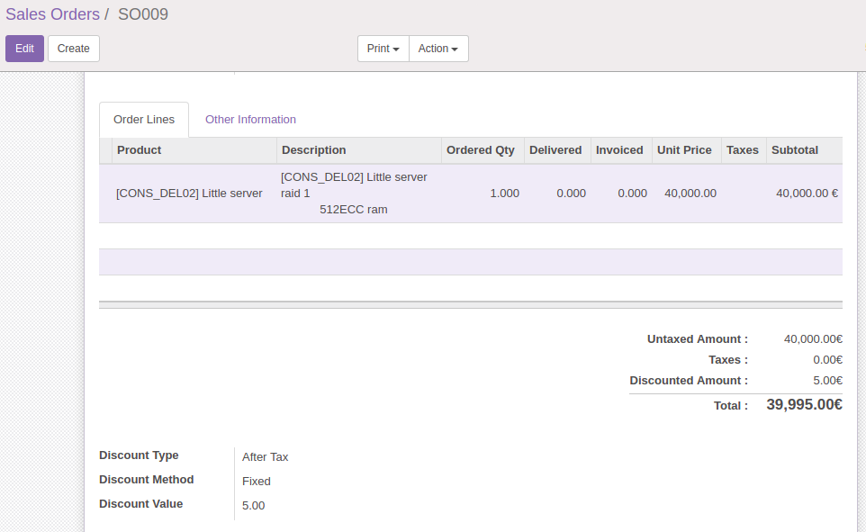

# About eb_sales_invoices_discounts

This module is used to add discounts to quotation ,sale order and invoice.
You can give two types of discount 

- by value or
- by percentage. 

While creating a sale order, you can select the Discount that you want to add, and the will update in your total, YOU ARE DONE!
It will look like this:

# Installation

Use git clone or just download the .zip package files, unzip at the addons directory, update the modules list and install the module. No further configuration is needed, you are good to go.
 
Have a great time user. It's a Simplify-ERP® creation. Add global discount to sale and invoice  with eb_sales_invoices_discounts!!! Cheers.

# Compatibility

This module is compatible with 9e, 9c, 10e, 10c.

# Contributors

This module was originally authored by [Geetha Reddy M.](https://github.com/Geetha503) at [Simplify-ERP®](http://www.simplify-erp.com/), and maintained by following authors.

- [Dajana Stojchevska](https://github.com/DajanaS)

We are reaching out to more contributors who can help with..

- testing this module
- making it compatible with more odoo versions
- maintain documentation

# Users

Currently this module is being used in the [odoo Sales](http://www.simplify-erp.com/) by Simplify-ERP®.

We are happy to list your delightful projects here. Just inform us with a few notes by email!

Feel free to comment and leave feedback.
Thank you!